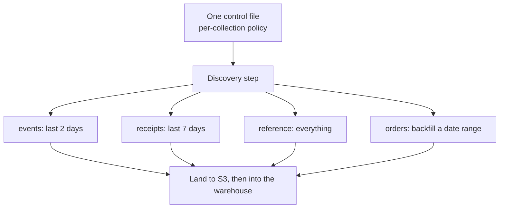

# Every Source Wants a Different Slice of History

Here's a decision that hides inside every ingestion pipeline, usually unexamined: **how far back do you pull on each run?**

The default answer is a single number baked into the code. "Every run, pull the last day from every collection." It's simple, it demos well, and it's wrong — because it assumes all your sources behave the same way, and they emphatically do not.

## The same window is wrong for everyone

Once you look closely, the collections feeding a warehouse fall into wildly different shapes, and each one wants a different slice of time:

- **High-volume, append-mostly streams** — events, logs, messages. Enormous, and once a row lands it never changes. You want a *tiny* recent window; pulling more is just paying to re-read data you already have.
- **Late-arriving data** — delivery receipts, external callbacks. A receipt for a message sent Monday might not arrive until Thursday. If your window is one day, you *permanently miss* the ones that land late. This collection needs a deliberately wider window than its volume alone would suggest.
- **Small, slowly-changing reference data** — lookup tables, question banks, config. Tiny, but a row edited long ago still matters. Here the cheapest correct thing is to just pull the *whole* collection every time; a "recent window" would silently drop old edits.
- **Deep historical backfills** — when you first onboard a source with years of history. You can't pull six years in one shot; you need to walk a date range in chunks small enough to fit a single file.

A global window can't serve all four. Tune it small and you lose late receipts and old edits. Tune it wide and you burn money re-reading immutable history on every run. There is no single number that's right.

## The idea: make ingestion policy data, not code

So I stopped encoding the window in the jobs and moved it into a **single control file** — one entry per collection, each declaring how much of itself to load:

```json
{
  "events":            { "window_days": 2 },
  "delivery_receipts": { "window_days": 7 },
  "reference_data":    { "window_days": 10000 },
  "orders":            { "backfill": true, "from": "2020-01-01", "to": "2026-01-01" }
}
```

Every field is a decision made explicit:

- `events` pulls a **2-day** window — recent, cheap, and safe because events don't change.
- `delivery_receipts` pulls **7 days** — deliberately wider than its volume warrants, precisely to catch the receipts that trickle in late.
- `reference_data` uses an absurd window (`10000` days) as a plain-English way of saying *"just take all of it"* — it's small, and completeness matters more than cleverness.
- `orders` is in **backfill** mode, walking an explicit date range so a huge history gets chunked into file-sized pieces instead of one impossible query.

At run time the pipeline reads this file, and for each collection it computes the exact slice to fetch and lands it. The discovery step turns the config into a fan-out — one ingestion task per collection, each sized by its own policy — which the orchestrator runs in parallel.



## Why this turned out to matter

What started as a tuning knob became one of the more useful pieces of the whole pipeline:

- **Correctness per source.** Late-arriving data stopped slipping through the cracks, because the collection that needed a wider window simply *says so*.
- **Cost control.** The giant append-only collections stopped re-reading history every run. The window shrank to exactly what changes.
- **Backfills without a code change.** Onboarding a new source, or re-pulling a range after a fix, is editing a config entry — flip `backfill`, set the dates — not writing a one-off script and babysitting it.
- **One place to reason about ingestion.** When something looks stale or duplicated, the first question — "what are we actually pulling for this collection?" — has an answer you can read in one file, not reverse-engineer from code.

The reframe I'd pass on: **the batch window isn't an implementation detail, it's a per-source policy** — and policy that differs by source belongs in configuration you can read and change, not scattered across the jobs that happen to run it. The moment ingestion volume became something each collection *declares* rather than something the code *assumes*, the pipeline got cheaper, more correct, and far easier to reason about — all at once.
