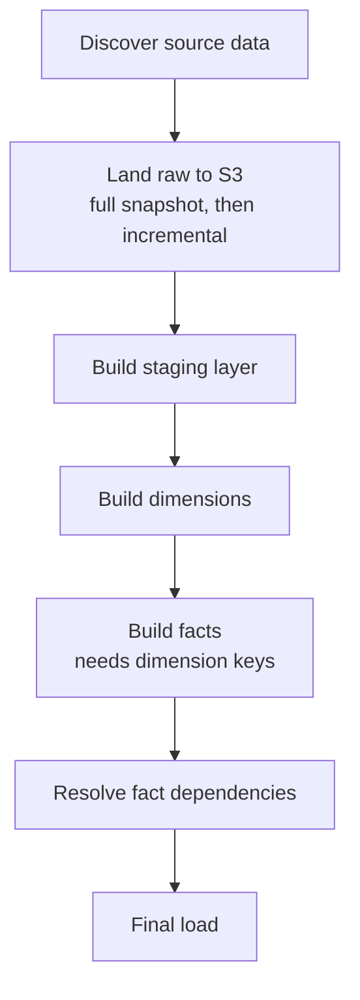

# From Hand-Deployed Jobs to an Orchestrated Pipeline

The data pipeline I work on moves records out of an operational store, lands them in S3, and shapes them into a warehouse people run reports against. When I inherited it, all of those steps existed — but the way they fit together lived mostly in someone's head and in a few things clicked into place by hand. Making it robust came down to two ideas, and neither of them was about the transformations.

## Idea one: the ordering *is* the pipeline

A pipeline reads like a straight line when you describe it, but it's really a dependency graph, and the edges are strict:

- You can't build fact tables before dimensions exist — facts reference dimension keys.
- You can't load the warehouse before staging is populated.
- Some source data has to land before the things derived from it.

When those constraints live in your head, everything is fine until a step fails at 3 a.m. and you're left reconstructing which stages ran, which didn't, and whether it's safe to just run it all again.

The shift that mattered was deciding that **the ordering deserves to be modeled explicitly**, not implied by the sequence you happened to trigger things in. So I moved the pipeline into a state machine where each stage is a state and the transitions *are* the dependencies:

Now the system itself refuses to start a stage before its prerequisites have succeeded. A failure stops the line instead of quietly feeding half-baked data into whatever comes next. When something breaks, the execution shows me exactly which stage failed and with what input — no log archaeology.

A nice consequence: the first stage *discovers* what source data exists at runtime and the next stage fans out over it in parallel, with a cap on concurrency so a wide fan-out doesn't hammer the source. Add a new source table and the pipeline picks it up on the next run. The orchestration adapts to the data instead of the data being forced to fit a hardcoded list.

## Idea two: if it isn't in a file, it isn't real

The bigger change was less glamorous and mattered more. The old setup was deployed by hand — the kind of thing that works exactly once and can't be reproduced, reviewed, or rolled back. There was no single artifact you could point at and say "this *is* the pipeline."

So I defined the whole thing declaratively — the state machine and the jobs it runs — as JSON in a serverless config, checked into the repo. That one move changed how the pipeline behaves as a piece of software:

- **It's reproducible.** Standing the pipeline up somewhere else is a deploy, not a memory test.
- **It's reviewable.** A change to the flow is a diff. You can see in a pull request that facts now depend on a new staging step.
- **It's reversible.** A bad change rolls back to the previous definition instead of a frantic afternoon of undoing manual clicks.
- **The diagram can't drift**, because the diagram *is* the deployed definition, not a stale drawing in a doc.

Click-ops feels faster on day one and quietly taxes you every day after. Putting the pipeline in a file pays that tax down to nearly zero.

## Designing for the 3 a.m. failure

Two smaller decisions made the whole thing survivable, and both follow from the ideas above:

- **Retry the flaky, fail the wrong.** Transient hiccups — a throttle, a brief timeout — get automatic retries with backoff. A genuine data or logic error is allowed to fail loudly. An infinite retry that hides a real bug is worse than a stopped pipeline.
- **Every stage is safe to re-run.** Because the machine halts at the failed stage, recovery is usually "fix the cause, start a new run." That only works if stages don't double-apply — so each one overwrites its partition or upserts rather than blindly inserting. Orchestration gives you restartability; idempotent stages make restarting *safe*.

## What I'd take to the next pipeline

None of this required an exotic tool. It required treating orchestration as a first-class concern rather than the glue between the "real" work. The transforms were always the easy part. The value showed up when the order between them became explicit, and when the whole arrangement became something living in the repo that I could read, review, and redeploy — instead of something I had to remember.
